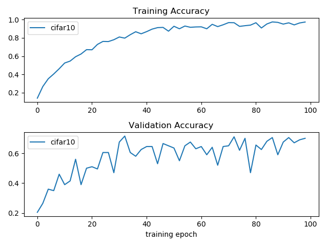

# mxnet-audio

Implementation of music genre classification, audio-to-vec, and music search in mxnet


# Features

### Audio Classification

* The classifier [ResNetV2AudioClassifier](mxnet_audio/library/resnet_v2.py) converts audio into mel-spectrogram and uses a simplified
 resnet DCnn architecture to classifier audios based on its associated labels. 
* The classifier [Cifar10AudioClassifier](mxnet_audio/library/cifar10.py) converts audio into mel-spectrogram and uses the cifar-10
DCnn architecture to classifier audios based on its associated labels. 

The classifiers differ from those used in image classification in that:
* they use softrelu instead relu. 
* they have elongated max pooling shape (as the mel-spectrogram is elongated "image")
* Dropout being added 


# Usage

### Train a audio classifier

The audio classification uses [Gtzan](http://opihi.cs.uvic.ca/sound/genres.tar.gz) data set to train the
music classifier to recognize the genre of songs. 

The classification works by converting audio or song file into a mel-spectrogram which can be thought of
a 3-dimension matrix in a similar manner to an image 

To train on the Gtzan data set, run the following command:

```bash
cd demo
python cifar10_train.py
```

The [sample codes](demo/cifar10_train.py) below show how to train Cifar10AudioClassifier to classify songs
based on its genre labels:

```python
from mxnet_audio.library.cifar10 import Cifar10AudioClassifier
from mxnet_audio.library.utility.gtzan_loader import download_gtzan_genres_if_not_found
import mxnet


def load_audio_path_label_pairs(max_allowed_pairs=None):
    download_gtzan_genres_if_not_found('./very_large_data/gtzan')
    audio_paths = []
    with open('./data/lists/test_songs_gtzan_list.txt', 'rt') as file:
        for line in file:
            audio_path = './very_large_data/' + line.strip()
            audio_paths.append(audio_path)
    pairs = []
    with open('./data/lists/test_gt_gtzan_list.txt', 'rt') as file:
        for line in file:
            label = int(line)
            if max_allowed_pairs is None or len(pairs) < max_allowed_pairs:
                pairs.append((audio_paths[len(pairs)], label))
            else:
                break
    return pairs


def main():
    audio_path_label_pairs = load_audio_path_label_pairs()
    print('loaded: ', len(audio_path_label_pairs))

    classifier = Cifar10AudioClassifier(model_ctx=mxnet.gpu(0), data_ctx=mxnet.gpu(0))
    batch_size = 8
    epochs = 100
    history = classifier.fit(audio_path_label_pairs, model_dir_path='./models',
                             batch_size=batch_size, epochs=epochs,
                             checkpoint_interval=2)


if __name__ == '__main__':
    main()
```

After training, the trained models are saved to [demo/models](demo/models). 

To test the trained Cifar10AudioClassifier model, run the following command:

```bash
cd demo
python cifar10_predict.py
```


### Model Comparison

Below compares training quality of 
[ResNetV2AudioClassifier](mxnet_audio/library/resnet_v2.py) and [Cifar10AudioClassifier](mxnet_audio/library/cifar10.py):




### Predict Music Genres

The [sample codes](demo/cifar10_predict.py) shows how to use the trained Cifar10AudioClassifier model to predict the
music genres:

```python
from random import shuffle

from mxnet_audio.library.cifar10 import Cifar10AudioClassifier
from mxnet_audio.library.utility.gtzan_loader import download_gtzan_genres_if_not_found, gtzan_labels


def load_audio_path_label_pairs(max_allowed_pairs=None):
    download_gtzan_genres_if_not_found('./very_large_data/gtzan')
    audio_paths = []
    with open('./data/lists/test_songs_gtzan_list.txt', 'rt') as file:
        for line in file:
            audio_path = './very_large_data/' + line.strip()
            audio_paths.append(audio_path)
    pairs = []
    with open('./data/lists/test_gt_gtzan_list.txt', 'rt') as file:
        for line in file:
            label = int(line)
            if max_allowed_pairs is None or len(pairs) < max_allowed_pairs:
                pairs.append((audio_paths[len(pairs)], label))
            else:
                break
    return pairs


def main():
    audio_path_label_pairs = load_audio_path_label_pairs()
    shuffle(audio_path_label_pairs)
    print('loaded: ', len(audio_path_label_pairs))

    classifier = Cifar10AudioClassifier()
    classifier.load_model(model_dir_path='./models')

    for i in range(0, 20):
        audio_path, actual_label_id = audio_path_label_pairs[i]
        predicted_label_id = classifier.predict_class(audio_path)
        print(audio_path)
        predicted_label = gtzan_labels[predicted_label_id]
        actual_label = gtzan_labels[actual_label_id]
        
        print('predicted: ', predicted_label, 'actual: ', actual_label)


if __name__ == '__main__':
    main()

```

### Audio to Vector

The [sample codes](demo/cifar10_encode_audio.py) shows how to use the trained Cifar10AudioClassifier model to encode an
audio file into a fixed-length numerical vector:

```python
from random import shuffle

from mxnet_audio.library.cifar10 import Cifar10AudioClassifier
from mxnet_audio.library.utility.gtzan_loader import download_gtzan_genres_if_not_found


def load_audio_path_label_pairs(max_allowed_pairs=None):
    download_gtzan_genres_if_not_found('./very_large_data/gtzan')
    audio_paths = []
    with open('./data/lists/test_songs_gtzan_list.txt', 'rt') as file:
        for line in file:
            audio_path = './very_large_data/' + line.strip()
            audio_paths.append(audio_path)
    pairs = []
    with open('./data/lists/test_gt_gtzan_list.txt', 'rt') as file:
        for line in file:
            label = int(line)
            if max_allowed_pairs is None or len(pairs) < max_allowed_pairs:
                pairs.append((audio_paths[len(pairs)], label))
            else:
                break
    return pairs


def main():
    audio_path_label_pairs = load_audio_path_label_pairs()
    shuffle(audio_path_label_pairs)
    print('loaded: ', len(audio_path_label_pairs))

    classifier = Cifar10AudioClassifier()
    classifier.load_model(model_dir_path='./models')

    for i in range(0, 20):
        audio_path, actual_label_id = audio_path_label_pairs[i]
        audio2vec = classifier.encode_audio(audio_path)
        print(audio_path)

        print('audio-to-vec: ', audio2vec)


if __name__ == '__main__':
    main()

```

### Music Search Engine

The [sample codes](demo/cifar10_search_music.py) shows how to use the trained Cifar10AudioClassifier model to search for
similar musics given a music file:

```python
from mxnet_audio.library.cifar10 import Cifar10AudioSearch
from mxnet_audio.library.utility.gtzan_loader import download_gtzan_genres_if_not_found


def load_audio_path_label_pairs(max_allowed_pairs=None):
    download_gtzan_genres_if_not_found('./very_large_data/gtzan')
    audio_paths = []
    with open('./data/lists/test_songs_gtzan_list.txt', 'rt') as file:
        for line in file:
            audio_path = './very_large_data/' + line.strip()
            audio_paths.append(audio_path)
    pairs = []
    with open('./data/lists/test_gt_gtzan_list.txt', 'rt') as file:
        for line in file:
            label = int(line)
            if max_allowed_pairs is None or len(pairs) < max_allowed_pairs:
                pairs.append((audio_paths[len(pairs)], label))
            else:
                break
    return pairs


def main():
    search_engine = Cifar10AudioSearch()
    search_engine.load_model(model_dir_path='./models')
    for path, _ in load_audio_path_label_pairs():
        search_engine.index_audio(path)

    query_audio = './data/audio_samples/example.mp3'
    search_result = search_engine.query(query_audio, top_k=10)

    for idx, similar_audio in enumerate(search_result):
        print('result #%s: %s' % (idx+1, similar_audio))


if __name__ == '__main__':
    main()

```


# Note

### On pre-processing

To pre-generate the mel-spectrograms from the audio files for classification, one can also first run the following scripts
before starting training, which will make the training faster:

```bash
cd demo/utility
python gtzan_loader.py
```

### audioread.NoBackend

The audio processing depends on librosa version 0.6 which depends on audioread.  

If you are on Windows and sees the error "audioread.NoBackend", go to [ffmpeg](https://ffmpeg.zeranoe.com/builds/)
and download the shared linking build, unzip to a local directory and then add the bin folder of the 
ffmpeg to the Windows $PATH environment variable. Restart your cmd or powershell, Python should now be
able to locate the backend for audioread in librosa

### Training with GPU

Note that the default training scripts in the [demo](demo) folder use GPU for training, therefore, you must configure your
graphic card for this (or remove the "model_ctx=mxnet.gpu(0)" in the training scripts). 


* Step 1: Download and install the [CUDA® Toolkit 9.0](https://developer.nvidia.com/cuda-90-download-archive) (you should download CUDA® Toolkit 9.0)
* Step 2: Download and unzip the [cuDNN 7.0.4 for CUDA@ Toolkit 9.0](https://developer.nvidia.com/cudnn) and add the
bin folder of the unzipped directory to the $PATH of your Windows environment 


